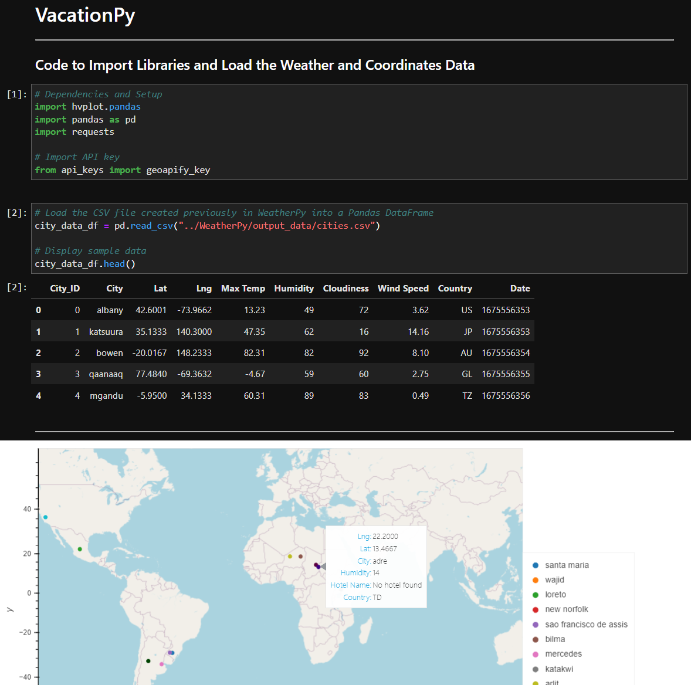

# WeatherPy
* Generates a random set of a latitude and longitutde coordinates 
* Takes those coordinates and finds the nearest city with the `citipy`
* Finally, uses the `OpenWeatherMap` API to obtain weather data given those cities, so as to allow analysis on linear relationships between latitude and variables including max temperature, humidity, cloudiness, and windspeed, with the data split between the two hemispheres

#### *WeatherPy Jupyter notebook is inside the WeatherPy directory, with the first four plots and dataframe saved in the output_data sub-directory*

---
# VacationPy
* Uses the data from WeatherPy and plots the cities on a map using humidity as the plot size
* Then filters the data to only have cities with idealized weather conditions and using the `Geoapify` API, finds the nearest hotel to each city and plots that on a map

#### *VacationPy Jupyter notebook is inside the VacationPy directory*

---
### Directory structure:
WeatherPy/  
├─ WeatherPy.ipynb  
├─ screenshot.png  
├─ output_data/  
│  ├─ Fig1.png  
│  ├─ Fig2.png  
│  ├─ Fig3.png  
│  ├─ Fig4.png  
│  ├─ cities.csv  
VacationPy/  
├─ VacationPy.ipynb  
